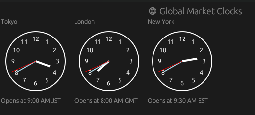

# Global Market Opening Clocks

A simple and intuitive web app/utility that displays the opening times of major financial markets across the globe — Asia, Europe, and New York — in your local time zone. Stay updated with real-time market opening hours to better plan your trading and investments.
Features

    Shows opening times for key markets: Asian markets (Tokyo), European markets (London), and New York Stock Exchange.

    Converts market opening times to your local time zone automatically.

    Highlights which markets are currently open or about to open.

    User-friendly interface for quick reference.

Stay ahead by knowing exactly when global markets open wherever you are!

